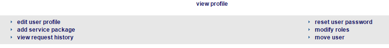
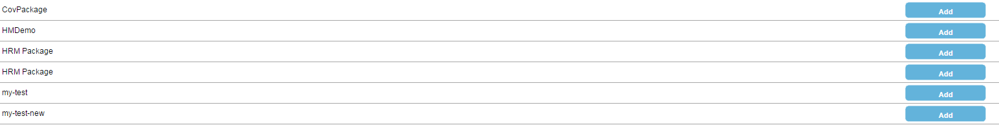
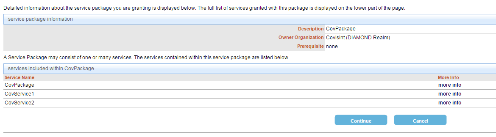

# Granting a Service Package to a User

## Description
This section illustrates how to grant a service package to a user.

## Who can perform this function?
Security Administrator

##Steps
1. Log into CIS.
2. Search, and select a user within your organization hierarchy.   

3. Click **add service package**.

4. Select the service packages you wish to add, and click **Add Checked**.

4. Select a package by clicking on the **Add** button.

5. Review the package details. Click **more info** to view services associated with the package. Click **Continue** to successfully grant a package to this organization.

## Result
You have successfully granted a service package to an organization.
