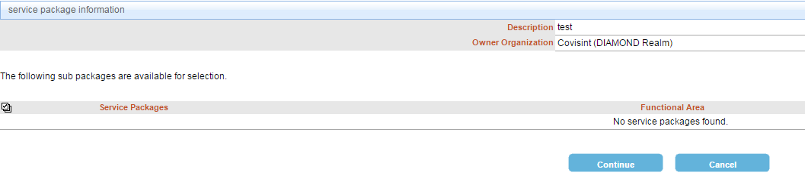

# Invite a user

## Description
Invite a new user to register with an organization.

##Who can perform this function?
* Security Administrator

## Steps
1. Log into CIS.
2. Click the **Administration** menu, select **Invite**, and then **Invite Users**.

3. Enter the email address, and click **Next**.

4. Review the information, and click **Continue**.  

## Result
You have successfully invited a user to register for access.