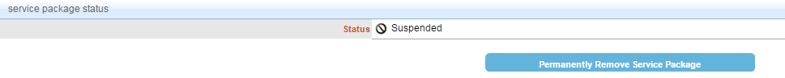

# Permanently Remove a Package from an Organization
## Description
This section depicts how to suspend a package from an organization.
###Note
If you remove a package at the organization level, the package grant for the users under that organization will also be removed.
##Who can perform this function?
* Security Administrator
* Service Administrator

## Steps
1. Log in to CIS.
2. Click the **My Organization** menu, and select **View my Organization Service Packages**.

3. Select the service package you wish to remove from the organization. Make sure the package is in the suspended state.
4. Under the **service package status** section, click the **Permanently Remove Service Package** button.

5. Enter the removal reason, and click the **Yes, Permanently Remove Service Package** button.

