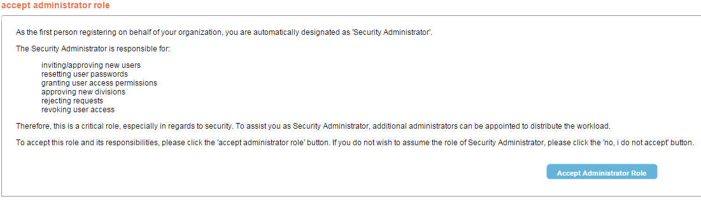
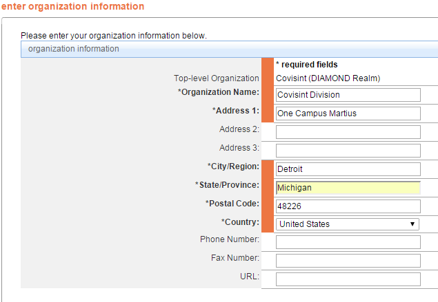
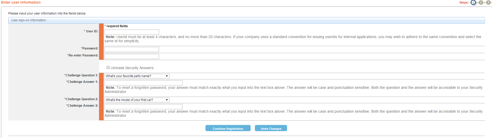

# Registering as a new organization

## Description
This section depicts the registration process for a new organization.

##Who can perform this function?
New user

## Steps
1.	Click on the invitation link received in the email.
2.	Click the **Accept Administrator Role** button.

3.	Enter your organization information, and click **Continue Registration**.   

4.	Enter the user information, and click **Continue Registration**.

5. Enter a userid and a password, and click **Continue Registration**.

6. Review the request, and click **Submit Registration**.

## Results
You have successfully registered for access as a new organization.