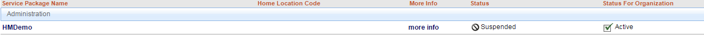

# Removing Package from User
## Description
This section illustrates how to permanently remove the user’s access to the service package.
## Who can perform this function?
Security Administrator.
##Steps
1. Log in to CIS.
2. Search and select the desired user.
3. Click the **view service packages** tab.
4. Select the package that has been suspended.

5. Under the **service package status** section, click the **Permanently Remove Service Package** button.

6. Enter the removal reason and click **Continue**. To notify the user, check the box at the bottom.

##Result
You have successfully removed the user's access to the service package.

