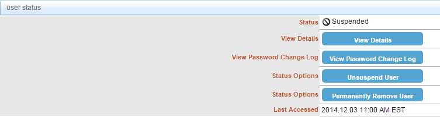
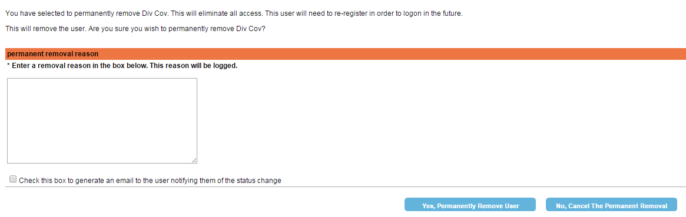

# Removing User
##Description
This section depicts how to permanently remove a user. Once the user is removed, they won't be able to access CIS.
##Note
To remove a user, you should first suspend the user.
## Who can perform this operation?
Security Administrator
##Steps
1. Log into CIS.
2. Search for the suspended user.
3. Under the **user status** section, click **Permanently Remove User**.

4. Enter a removal reason and click **Yes, Permanently Remove User**. To notify the user of their removal, check the box at the bottom.

##Result
You have successfully removed a user.

