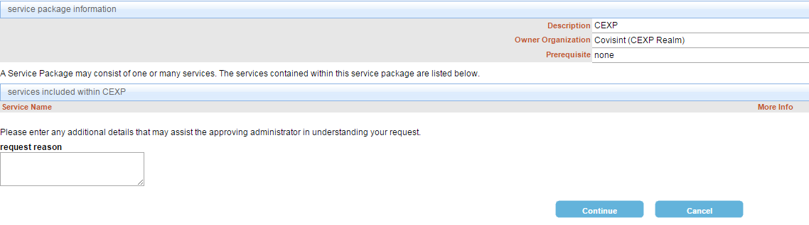

# Requesting Service Package
## Description
This section illustrates how a user can request a service package. A user will only be able to request service packages available for their organization.
## Who can perform this function?
A user with basic user role and above
##Steps
1. Log in to CIS.
2. Click the My Profile menu.
3. Click **Request a Service Package**.     

4. Select the desired service package by clicking the **Request** button.

5. Review the details of the package you are requesting, enter the request reason, and click **Continue**.

##Result
Your service package request has been submitted successfully.

