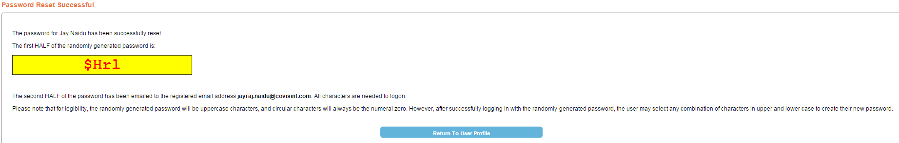

# Resetting 

## Description
Use this option to reset a user's password, if the user doesn’t remember their old password, and has access to their registered email address.

## Who can perform this operation?
Security Administrator

##Steps
1. Log into CIS.
2. Search and select the desired user.
3. Click **My Profile**, and then **View my Profile**.
4. Click **reset user password**.

5. Review the steps (Confirm the security answers with the user), and click **Reset Password**.
6. The first HALF of the randomly generated password is displayed on the screen. The second HALF of the password is emailed to the registered email address. Password reset is successful.

##Result
1. You have successfully reset the password for the user.
2. The user would have to log into CIS using the temporary password mentioned above.
3. Create a new password to change the temporary password.

