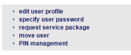
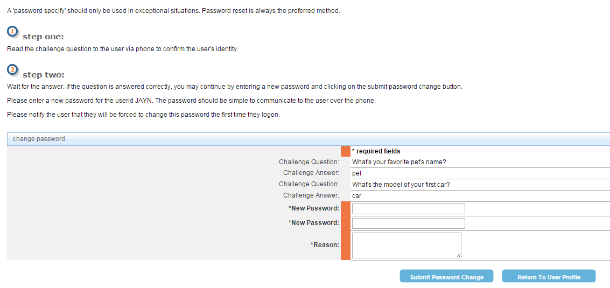
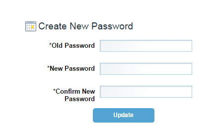

# Specifying Password

## Description
Use this option if the user doesn’t remember their old password, and doesn’t have access to their registered email address.

### Note
A 'password specify' should only be used in exceptional situations. Password reset is always the preferred method.

## Who can perform this operation?
* Security Administrator

##Steps
1. Log into CIS.
2. If you’re a security administrator, search for the user, and view their profile. Else, click the **My Profile** menu, and then select **view my profile**.
3. Click **specify user password**.     

4. Verify the user’s identity, and submit the new password by clicking the **Submit Password Change** button.

##Result
1. You have successfully changed the password for the user.
2. The user would have to log into CIS using the temporary password mentioned above.
3. Create a new password to change the temporary password.
