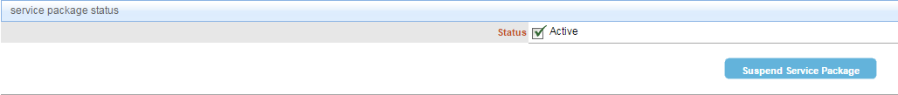

# Suspend a Package from a User
## Description
This section depicts how to suspend a package from a user.
##Who can perform this function?
* Security Administrator

## Steps
1. Log into CIS.
2. Search and select the desired user.
3. Click the **view service packages** tab.

4. Select the service package you wish to suspend.

5. Under the **service package status** section, click the **Suspend Service Package** button.

6. Enter the reason for suspension, and click the **Continue** button.

## Result
You have successfully suspended the user’s access to the service package.