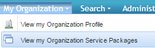

# Suspend a Package from an Organization
## Description
This section depicts how to suspend a package from an organization.
###Note
If you suspend a package at the organization level, the package grant for the users will also be suspended.
##Who can perform this function?
* Security Administrator
* Service Administrator

## Steps
1. Log in to CIS.
2. Click the **My Organization** menu and select **View my Organization Service Packages**.

3. Select the service package you wish to suspend.
4. Under the **status** section, click the **suspend** button.

5. Enter the suspension reason, and click the **Yes, Proceed With Suspension** button.

