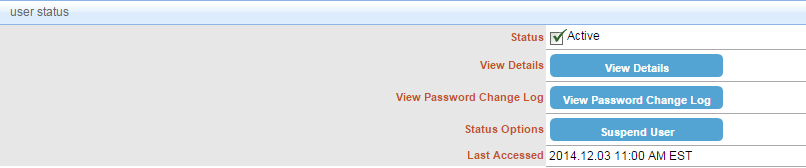

# Suspend a User
## Description
This section depicts how to suspend a user. Once you the user is suspended, they won't be able to log into CIS.

##Who can perform this function?
Security Administrator

## Steps
1. Log in to CIS.
2. Click the **Search** menu to search for a user.
3. Under the **user status** section, click suspend user.

