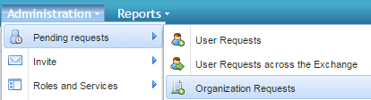
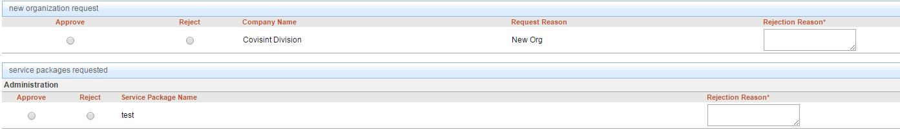

# Approve a Pending Organization Request
## Who can perform this function?
Security Administrator.
## Steps
1. Log into CIS.
2. Click the **Administration** menu, select **pending requests** and then **Organization requests**.  

3. Click      to review the request to approve or reject. Check the box next to **Include all divisions** to review requests from all the divisions within your organization hierarchy.
4. Under new organization request section, select the radio button below Approve column to approve the request, or click the radion button below Reject column, and enter the rejection reason to reject the request.

5. Click **Submit Decision**    

## Result:
You have successfully submitted your decision.

