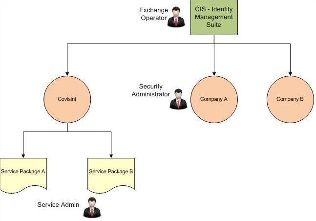

# Identity Management Roles

## Exchange Operator
The Exchange Operator role is generally given to those few individuals who are managing company level membership for the platform.  The primary function of the role is to allow the operators to invite new companies to join the platform, and to grant other types of roles, such as the CCA Service Administrator. In the role map below, an individual with this role has invited Company A and Company B to register with Platform. Company A and Company B are registered as a top-level organization in Platform.

## Security Administrator
The Security Administrator role is granted to the user that registers a company or division on the platform.  It gives them the ability to manage their company or division in CCA, by providing them access to tools they can use to invite users or to delegate that task of user management to additional divisions.  The initial security admin for a company or division can grant this role to other users that they invite. In the role map below, each company will have it's own security administrator.

## Service Administrator
Service Administrators have the ability to grant service packages (i.e. applications) to companies that are registered on the platform.  These service packages act as the top-level authorization when trying to access applications, so you will often see at least one role for each application that is tied a service package. In the role map below, the Service Administrator is responsible for managing access grants to Serice Package A and Service Package B. The can grant the service packages to Company A and/or Company B.

# Role Map

